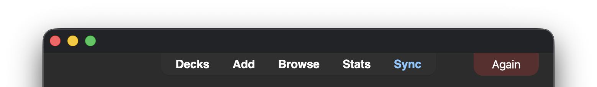
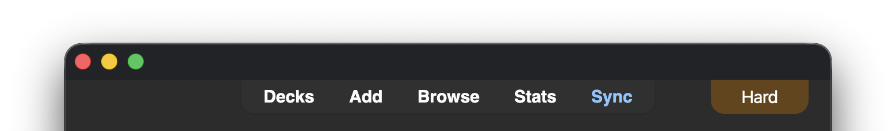
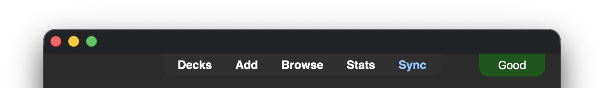
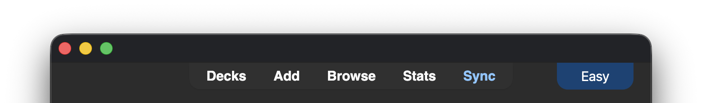

# Show Answer Button Pressed

An Anki add-on that shows which ease button (Again/Hard/Good/Easy) you just pressed as a color-coded label in the top-right corner of the main window, auto-hiding after 1.5 seconds. Handy for confirming you pressed the button you meant to, especially when answering with keyboard shortcuts.

## Screenshots

## Configuration

Configurable from **Tools → Add-ons → Show Answer Button Pressed → Config**:

| Key | Description | Default |
| --- | --- | --- |
| `language` | Language for the button labels: `en` (English) or `ga` (Irish / Gaeilge) | `en` |
| `debug_always_show` | Keep the label visible at all times instead of auto-hiding, for tweaking position/styling | `false` |
| `hide_duration_ms` | How long (in milliseconds) the label stays visible after answering before auto-hiding | `1500` |

See [config.md](config.md) for details.

## Installation

Copy this folder into your Anki add-ons directory (Tools → Add-ons → Open Add-ons Folder), then restart Anki.

## Credits

Inspired by [Color Confirmation](https://ankiweb.net/shared/info/1084228676), itself a modification of an earlier Answer Confirmation add-on. This is an independent implementation, no code is shared with either.

## License

[MIT](LICENSE)
